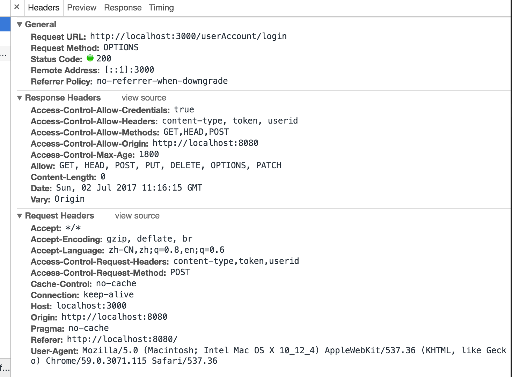
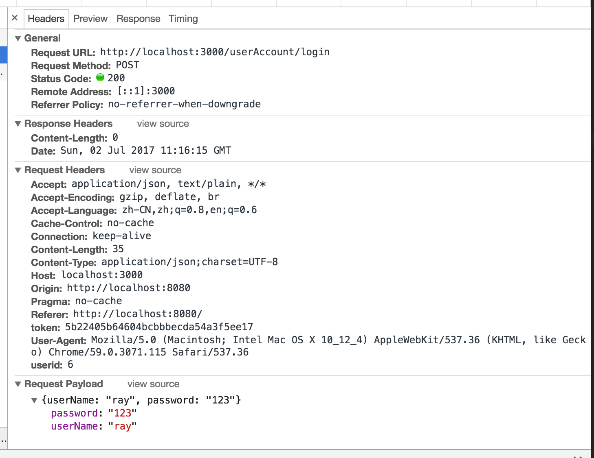

# StormrageMQ
Master主节点 ：服务端口号3000

redis端口号6379

Postgres端口号5432

前端Vue + Element UI

#### Build & Run

```shell
# 先打包前端页面 注意换前端地址
cd Master/src/main/vue/front
npm install
npm run dev

# 再打包后端jar，注意换后端数据库地址
cd Master
mvn install 
mvn package

# docker 部署
mvn clean package
docker-compose up
```

## 坑点

1.Netty启动服务后会阻塞进程，所以无法执行到.start()方法后的register()代码。

2.@EventListener(ContextRefreshedEvent.class)这句话在spring启动的时候会调用，但是启用netty时并不好用。我最终的解决办法是开启两个线程，一个调用.start()方法启动netty服务，另一个调用register()方法在master上注册MQ。

3.Vue build中会出现

```
ERROR in static/js/0.97abe251a6a4f8fd5190.js from UglifyJs
Unexpected token: punc (() ./~/element-ui/packages/row/src/row.js:24,0

ERROR in static/js/vendor.5e8b5a3882b856bca3dd.js from UglifyJs
Unexpected token: operator (>) ./~/element-ui/src/mixins/emitter.js:2,0
```

这个报错，解决办法，升级webpack到2以上，并且在webpack.base.conf.js中修改这段代码变为这样 ，参考https://github.com/webpack/webpack/issues/1542  luotaoyeah的回答

```js
{
  test: /\.js$/,
  loader: 'babel-loader',
  include: [
  			resolve('src'), 
  			resolve('test'), 
  			resolve('node_modules/element-ui/packages'), 											resolve('node_modules/element-ui/src')
  ]
}
```

4.跨域请求在spring中很容易处理

```java
//spring mvc跨域支持
@Bean
public WebMvcConfigurer webMvcConfigurer(){
    return new WebMvcConfigurerAdapter() {
        @Override
        public void addCorsMappings(CorsRegistry registry) {
            registry.addMapping("/**")
                    .allowedOrigins("*");
        }

        @Override
        public void addInterceptors(InterceptorRegistry registry) {
            registry.addInterceptor(new HandlerInterceptorAdapter() {
                @Override
                public boolean preHandle(HttpServletRequest request, HttpServletResponse response, Object handler) throws Exception {
                    if(request.getMethod().equals("OPTIONS")) return true;      //跨域的请求
                    if(xxxx)return false;
                    else return true
                }
            }).addPathPatterns("/**");
        }

    };
}
```

重写addCorsMappings() 这个方法就好了，但是要注意下面的拦截器，跨域会发送两个请求，第一个是OPTIONS类型的，如下图





第一个请求是发起跨域的请求，请求类型为OPTIONS，主要是Access-Controller-Allow-xxxxx这些，第二个请求才是自己定义的请求，真正的类型为POST，所以在拦截器中一定要处理好对第一个请求的事件，我第一次就是因为忽略了第一个请求才一直获取不到请求头header中的内容（token和userid）

## SQL

```mysql
CREATE DATABASE stormragemq;

\c stormragemq;

CREATE TABLE useraccount(
  id SERIAL PRIMARY KEY,
  username VARCHAR(30) NOT NULL UNIQUE ,	--用户名
  password VARCHAR(255) NOT NULL ,					--密码
  headimage VARCHAR(255),					--头像
  createtime TIMESTAMP DEFAULT CURRENT_TIMESTAMP,	--创建时间
  logintoken VARCHAR(511),						--登录token
  isdeleted SMALLINT NOT NULL DEFAULT 0			--是否被删除
);

CREATE TABLE exchanger (
  id SERIAL PRIMARY KEY,
  type INT NOT NULL ,                 --交换机类型
  name VARCHAR(100) NOT NULL ,        --交换机名称
  content TEXT,                       --交换机匹配规则，如果是fanout就是队列名称，topic就是正则表达式
  createtime TIMESTAMP DEFAULT CURRENT_TIMESTAMP,
  createuserid INT
);

CREATE TABLE queue (
  id SERIAL PRIMARY KEY,
  name VARCHAR(100) NOT NULL ,                    --队列名称
  addresslist TEXT,                               --推送的主机名称列表
  createtime TIMESTAMP DEFAULT current_timestamp,  --创建时间
  createuserid INT                                --创建者id
);

CREATE TABLE message(
  uuid VARCHAR(50) PRIMARY KEY,
  content TEXT,                                   --消息主要内容
  username VARCHAR(30),                           --账号（首次验证使用）
  exchangername VARCHAR(100),                     --交换器名称
  createtime TIMESTAMP DEFAULT current_timestamp, --创建时间
  type VARCHAR(10),                               --消息类型 0初始化消息，1普通消息，2重要消息
  cls VARCHAR(50),                                --哪个类序列化而来
  clientname VARCHAR(100),                        --client的名称
  clienttype INTEGER                              --client的类型，1生产者，2消费者
);

CREATE TABLE queuemessage(
  id VARCHAR(50) PRIMARY KEY,                     --id
  queuename VARCHAR(100),                         --队列名出
  consumername VARCHAR(100),                      --消费者名称
  createtime TIMESTAMP DEFAULT current_timestamp, --创建时间
  isreceived BOOLEAN,                             --是否接收完成
  sending BOOLEAN,                                --是否发送了
  messageid VARCHAR(50)                           --消息id
);

CREATE TABLE messagestatistics(
  id SERIAL PRIMARY KEY,                          --主键
  name VARCHAR(100),                              --统计名称
  count INT,                                      --统计的数量
  statisticstime TIMESTAMP,                       --哪一天的
  createtime TIMESTAMP DEFAULT CURRENT_TIMESTAMP  --创建时间
);

--使用例子
CREATE TABLE demouser(
  id SERIAL PRIMARY KEY,           --主键
  username VARCHAR(100),           --用户名
  password VARCHAR(255),           --密码
  lastlogintime TIMESTAMP,         --上次登录时间
  points INTEGER,                  --积分
  ticket VARCHAR(255)               --登录时更新的ticket
);
```

